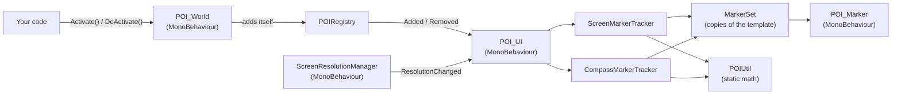

# POI: Points of Interest

Drop-in points of interest for Unity uGUI. Put **POI World** on any object, assign an icon, and call
`Activate()`: the icon appears in two places on a Screen Space - Overlay canvas.

- **On screen**, over the point's position. While the point is out of view, behind the camera included, the
  icon hugs the edge of the screen viewport on the point's side, like a compass needle.
- **On the compass**, sliding horizontally with the camera's heading, with the distance from the player
  underneath.

Both icons stay fully inside their viewports, with configurable padding, at any resolution, aspect ratio or
camera speed. `DeActivate()` hides them again.

## Quick start

1. Open `POI/Samples/Scenes/POIDemo.unity` and press Play.
2. The tower is ahead, the shop is just off screen to the left, and the danger and camp points are behind the
   camera, so every case shows straight away. The screen viewport is tinted blue and the compass bar is dark
   grey, so their areas are visible.

| Action               | Keyboard & mouse    | Gamepad              |
|----------------------|---------------------|----------------------|
| Move                 | WASD or arrow keys  | Left stick           |
| Down / up            | Q / E               | Left / right shoulder|
| Look                 | Hold right mouse    | Right stick          |
| Move fast            | Hold Shift          | Press left stick     |
| Spin a turn a second | Space               | Y / Triangle         |
| Toggle a point       | 1-4                 |                      |
| Toggle all points    | 0                   | X / Square           |

Things worth trying: sprint and spin to see the markers keep up with a fast camera, and resize the Game view,
or switch it between landscape and portrait, while playing. The Console logs each resolution change.

## Adding points of interest

1. **GameObject > UI > POI UI** adds the prefab, a Screen Space - Overlay canvas, to the scene. You can also drag
   in `POI/Prefabs/POI_UI.prefab`.
2. Select it and assign the **Camera** (the main camera is used when empty) and the **Player** that distances
   are measured from (the camera is used when empty).
3. Add **Add Component > POI > POI World** to any object and assign its **Icon**. The **Position** starts at the
   object's position. It is fixed in world space: drag it with the handle in the Scene view, or click
   **Use Transform Position**.
4. Call `Activate()` and `DeActivate()` from your code. In Play Mode the POI World inspector also has buttons
   for both.

```csharp
using POI;
using UnityEngine;

public class Quest : MonoBehaviour
{
    [SerializeField] POI_World m_Objective;

    public void Begin() => m_Objective.Activate();     // Shows the icon on screen and on the compass.
    public void Complete() => m_Objective.DeActivate(); // Hides it again.
}
```

POI World and the UI never reference each other: active points are listed in `POIRegistry.Default`, and every
POI UI in the scene shows what is listed. A point on a disabled GameObject stays hidden until the GameObject is
enabled again, and destroying it removes its icons.

## Configuring the UI

Everything is set on **POI UI**. The two sections are plain serializable objects, laid out open in the
Inspector, which also flags missing references and other setup mistakes.

| Setting | Default | Meaning |
|---|---|---|
| Camera | main camera | Everything is relative to this camera. |
| Player | camera | Distances are measured from this transform. |
| Screen Resolution Manager | found or added | Reports resolution changes, so the layout is refreshed. |
| Screen › Viewport | prefab | The rectangle screen icons move within, such as your safe area. |
| Screen › Template | prefab | The icon copied for each point. Its size is what is kept inside the viewport. |
| Screen › Padding | 16 on each edge | Space kept between the icons and each edge of the viewport, in canvas units. |
| Compass › Viewport | prefab | The rectangle compass icons slide along, such as the inside of your compass bar. |
| Compass › Template | prefab | The icon copied for each point, with the distance label under it. |
| Compass › Field Of View | 180 | Degrees of heading the viewport's width spans, centered on where the camera faces. |
| Compass › Padding | 8 | Space kept between the icons and the left and right edges, in canvas units. |
| Distance Format | `{0} m` | Text of distance labels; `{0}` is the distance in whole meters. |

**Using your own rectangles.** Any RectTransform on a canvas can be a viewport. For the compass, set
**Field Of View** to the number of degrees your compass graphic spans across the viewport's width, so the icons
line up with its N, E, S and W. The sample's `CompassHeadingExample` shows this with stand-in directions.

**Templates.** A template is a UI object with a **POI Marker** component, which points to the **Icon** image and
an optional **Distance Label** (TextMesh Pro). Size and style it as you want the icons to look; templates are
hidden at runtime and one copy is made per point, as a child of the viewport. The template's children, such as
the distance label, count towards its size, so they are never cut off either. Compass icons keep the template's
height and only move horizontally. Keep layout groups off the viewports, as they would fight the icons for
their positions.

## How it works

- **Screen icons.** The point is projected with the camera. A point level with or behind a perspective camera
  has no projection (Unity's would be mirrored to the wrong side), so its direction in the camera's view is used
  instead. Inside the viewport the icon sits on the point; outside, it moves onto the viewport's edge along the
  line from the viewport's center towards the point. The area the icon's pivot can use is the viewport minus
  the padding and minus the icon's own size around its pivot, children included, so it is never cut off.
- **Compass icons.** The heading is the camera's forward direction flattened onto the ground, so looking up or
  down does not move the icons. Each point's bearing from that heading, from -180 to 180 degrees, maps linearly
  onto the viewport's width over the field of view, and is clamped to the padded edges.
- **Fast cameras.** Icons are placed in LateUpdate with a late execution order (10000), after camera
  controllers, Cinemachine included, have moved the camera that frame. Positions are exact for the frame being
  drawn, with no smoothing, so icons never trail the camera however fast it moves or turns.
- **Resolution changes.** **Screen Resolution Manager** checks the screen's size and safe area once per frame,
  before other scripts (execution order -10000), and raises `ResolutionChanged`. POI UI then brings the canvas up
  to date and re-reads the viewport and icon sizes within the same frame. Other systems can subscribe too.
- **Overlaps.** Icons of points in the same direction overlap, and on the compass that includes every point
  beyond the same edge.

## Architecture

Only the components you place are MonoBehaviours: **POI World**, **POI UI**, **POI Marker** and **Screen
Resolution Manager**. Everything else is plain C#, so it can be tested and reused without a scene. Everything
lives in the `POI` namespace.



| Type | Kind | Responsibility |
|---|---|---|
| `POI_World` | MonoBehaviour | A point of interest: icon, fixed position, `Activate` / `DeActivate`. |
| `IPointOfInterest` | Interface | What the UI needs from a point: icon and position. |
| `POIRegistry` | Plain C# | The active points, with `Added` / `Removed` events. |
| `POI_UI` | MonoBehaviour | Composition root: camera, player, resolution, the two sections, and the per-frame update. |
| `ScreenMarkerSettings`, `CompassMarkerSettings` | Serializable | The Screen and Compass sections: viewport, template, padding and tuning. |
| `ScreenMarkerTracker`, `CompassMarkerTracker` | Plain C# | Where each icon goes this frame. |
| `MarkerTracker` | Plain C#, abstract | Owns a section's markers and layout; subclasses only place them. |
| `IPOITracker` | Interface | Contract for any kind of marker, fed the same points and camera. |
| `MarkerSet` | Plain C# | One copy of a template per point, reused when points are deactivated. |
| `POI_Marker` | MonoBehaviour | One icon: its image and optional distance label. |
| `ScreenResolutionManager` | MonoBehaviour | Polls the screen once per frame and raises `ResolutionChanged`. |
| `ScreenResolution`, `ScreenResolutionTracker` | Plain C# | A reading of the screen, and change detection between readings. |
| `EdgePadding` | Serializable | Padding per edge, as a plain value. |
| `POIViewContext` | Struct | Camera and player positions for one frame. |
| `POIUtil` | Static | Projection, edge clamping, sizes around a pivot, and compass bearings. |

How it maps to SOLID:

- **Single responsibility:** points, the registry, resolution tracking, placement math, marker pooling and
  presentation are separate classes.
- **Open/closed:** new kinds of markers, such as a minimap, implement `IPOITracker` (or extend
  `MarkerTracker`) and are added with `POI_UI.AddTracker`, without changing the UI.
- **Liskov substitution:** any `IPointOfInterest` can stand in for `POI_World`, and any `IPOITracker` for the
  shipped trackers.
- **Interface segregation:** the UI needs only an icon and a position from a point, and trackers only the
  per-frame `POIViewContext`.
- **Dependency inversion:** points and the UI depend on `POIRegistry` and interfaces, not on each other.

Points that are not GameObjects, for example from a quest system, can implement `IPointOfInterest` and be added
to `POIRegistry.Default` directly.

## Moving POI to another project

The `POI` folder is self-contained: code, prefab, sample and tests reference each other by GUID, so the folder
can go anywhere under `Assets`.

1. Copy the whole `POI` folder, **including its `.meta` files**, into the new project's `Assets` folder (any
   subfolder works, e.g. `Assets/Plugins/POI`).
2. Check these packages are installed (**Window > Package Manager**). New Unity 6 projects already have them:
   - **Unity UI** (`com.unity.ugui`) 2.0, which includes TextMesh Pro.
   - **Input System** (`com.unity.inputsystem`), only for the demo's controls. Without it the sample scripts
     are skipped instead of failing to compile.
   - **Test Framework** (`com.unity.test-framework`), only to run the tests.
3. Import TextMesh Pro's resources with **Window > TextMeshPro > Import TMP Essential Resources**, for the
   distance labels' font.

This was verified by dropping the folder into a fresh **3D (Built-In Render Pipeline)** project at
`Assets/Plugins/POI`: after importing the TMP resources, all tests passed and the prefab had no missing scripts
or references. The POI UI is plain uGUI, so it works with any render pipeline. Only the demo scene is
URP-specific: in other pipelines its meshes need their materials converted, and its light shows a missing URP
light data script, which is harmless. To ship only the system, delete `Samples` and `Tests`; nothing else
depends on them.

| Assembly | Folder | References |
|---|---|---|
| `POI.Runtime` | `Runtime` | `UnityEngine.UI`, `Unity.TextMeshPro` |
| `POI.Editor` | `Editor` | `POI.Runtime`, `UnityEngine.UI`, `Unity.TextMeshPro` (Editor only) |
| `POI.Samples` | `Samples/Scripts` | `POI.Runtime`, `Unity.InputSystem`, `Unity.TextMeshPro`, `UnityEngine.UI` |
| `POI.Tests.EditMode` / `POI.Tests.PlayMode` | `Tests` | `POI.Runtime`, `Unity.TextMeshPro`, `UnityEngine.UI`, Test Framework |

## Code conventions

The same as the rest of this project:

| Element | Convention | Example |
|---|---|---|
| Serialized fields | `m_` + PascalCase | `m_Icon` |
| Other private fields | `_` + camelCase | `_registry` |
| Private static fields | `s_` + PascalCase | `s_Default` |
| Constants | `k_` + PascalCase | `k_ExecutionOrder` |
| Types, methods, properties, events | PascalCase | `ResolutionChanged` |

The components you place carry a `POI_` prefix (`POI_World`, `POI_UI`, `POI_Marker`) so they are easy to find.

## Project layout

```
POI/
├─ Runtime/        POI.Runtime: POI_World, POI_UI, POIRegistry, Core/ (POIUtil), Resolution/, Settings/, Tracking/, View/
├─ Editor/         POI.Editor: POI World and POI UI inspectors, and the GameObject > UI > POI UI menu item
├─ Prefabs/        POI_UI.prefab
├─ Samples/        Demo scene, fly camera, demo and stand-in compass scripts, icons and materials (safe to delete)
└─ Tests/          EditMode (math, registry, resolution, markers, trackers) and PlayMode (POI_World and POI_UI end to end)
```

## Tests

Run them from **Window > General > Test Runner**, or headless with the Unity CLI while the project is closed in
the Editor:

```bash
unity test . --mode EditMode
```

```bash
unity test . --mode PlayMode
```

The EditMode suite covers the math (projection, behind-camera directions, edge clamping, padding, bearings),
the registry, resolution change detection, marker pooling, and both trackers driven with an 800x600 camera,
including a check that screen icons stay fully inside the padded viewport in every direction. The PlayMode suite
covers activation, deactivation, disabled and destroyed points, the distance label, layout refreshes, a missing
camera, and a camera turned 37 degrees per frame in LateUpdate, checking the icons keep up within the same frame.

## Requirements

- Unity 6000.3 or newer
- uGUI 2.0 (includes TextMesh Pro), with TMP Essential Resources imported
- Input System, for the demo scene only
