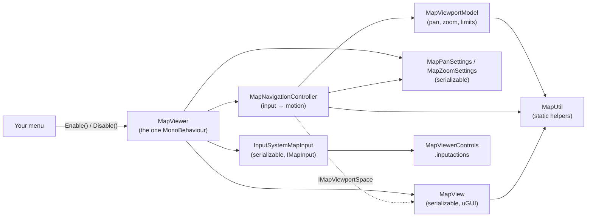

# Map Viewer

A drop-in, pan-and-zoom map for Unity uGUI, built on the Input System. Designers assign any sprite in the
Inspector; players pan and zoom with a gamepad or keyboard and mouse. Two calls, `Enable()` and `Disable()`,
show and hide it, so it slots into a main menu or pause menu.

  

## Quick start

1. Open `Assets/MapViewer/Samples/Scenes/MapViewerDemo.unity` and press Play.
2. The map opens full screen over a mock pause menu. Press **Esc** / **B** to close it, and **Open Map**,
   **Enter** / **A** or **M** / **View** to open it again.

| Action   | Gamepad                  | Keyboard & mouse      |
|----------|--------------------------|-----------------------|
| Pan      | Left stick or D-pad      | Middle-click and drag |
| Zoom in  | Right trigger            | Scroll up             |
| Zoom out | Left trigger             | Scroll down           |

Triggers are analog: a light press zooms slowly. Scroll zoom keeps the point under the cursor in place.

## Adding a map to your UI

1. **GameObject > UI > Map Viewer** adds the prefab to the selected canvas. It creates a canvas and an
   EventSystem if the scene has none. You can also drag in `MapViewer/Prefabs/MapViewer.prefab`.
2. Select it and assign your image to **Map Sprite**. Any sprite works; the aspect ratio is kept and the
   Scene view previews it straight away.
3. The prefab stretches to its parent. Anchor or resize it to embed the map in a panel instead.

For sharp results when zooming, import map sprites with **Generate Mip Maps** on, **Wrap Mode** set to
Clamp and a **Max Size** large enough for your highest zoom.

## Configuring the map

Everything is set on one component, **Map Viewer**. Each section is a plain serializable object, so the
Inspector stays in one place while the code stays modular. Changes made in Play Mode apply immediately.
To share tuning between menus, use prefab variants or Unity Presets.

| Section › Setting | Default | Meaning |
|---|---|---|
| Map Sprite | none | The map to display. |
| Reset View On Enable | On | Return to the default zoom, centered, every time the map is enabled. |
| Pan › Speed | 1 | Stick / D-pad pan speed, in viewport lengths per second (along the shorter side). |
| Pan › Smooth Time | 0.08 | Seconds for stick panning to ease in and out. 0 responds instantly. |
| Pan › Invert | Off | Off: the stick moves the view. On: the stick pushes the map. |
| Pan › Drag Sensitivity | 1 | 1 keeps the map locked under the cursor while dragging. |
| Pan › Drag Only Over Map | On | A drag only starts when the button is pressed over the map. |
| Zoom › Fit Mode | Fit | Map size at 1x zoom. Fit shows the whole map; Fill covers the viewport. |
| Zoom › Min Zoom / Max Zoom | 1 / 4 | Zoom limits, as multiples of the Fit Mode size. |
| Zoom › Default Zoom | 1 | Zoom after the view is reset. |
| Zoom › Speed | 1.5 | Trigger zoom speed, in doublings per second. |
| Zoom › Step Multiplier | 1.25 | Zoom per scroll-wheel notch. |
| Zoom › Zoom Towards Pointer | On | Scroll zoom keeps the point under the cursor in place. |
| Zoom › Scroll Only Over Map | On | Scroll zoom only applies while the cursor is over the map. |
| Zoom › Smooth Time | 0.1 | Seconds for zoom changes to ease in. 0 zooms instantly. |
| Input | wired | Input action references the map reads. |
| View | wired | The UI objects that display the map. The prefab wires them; leave as is. |
| Events | none | **On Enabled** / **On Disabled** callbacks. |

Bindings live in `MapViewer/Input/MapViewerControls.inputactions`, in a dedicated **Map** action map that is
only enabled while a map is open. Rebind or add devices there (for example WASD for **Pan**) without
touching code.

| Action | Type | Bindings |
|---|---|---|
| Pan | Vector2 | Left stick, D-pad |
| Zoom | Axis | 1D axis: right trigger (+), left trigger (−) |
| ZoomStep | Axis | Mouse scroll Y |
| Drag | Button | Middle mouse button |
| Point | Vector2 | Mouse position |

## Integrating with a menu

`MapViewer` implements `IMapViewer`, the contract a menu needs:

```csharp
using Maps;
using UnityEngine;

public class PauseMenu : MonoBehaviour
{
    [SerializeField] MapViewer m_Map;
    [SerializeField] GameObject m_Buttons;

    void OnEnable() => m_Map.EnabledChanged += OnMapEnabledChanged;
    void OnDisable() => m_Map.EnabledChanged -= OnMapEnabledChanged;

    public void OpenMap() => m_Map.Enable();    // Shows the map and enables all of its input actions.
    public void CloseMap() => m_Map.Disable();  // Hides the map and disables all of its input actions.

    void OnMapEnabledChanged(bool isOpen) => m_Buttons.SetActive(!isOpen);
}
```

No code is needed for the basics: point a Button's **On Click** at `MapViewer.Enable`, and use the
**Events** section in the Inspector to react to it.

| Member | Purpose |
|---|---|
| `Enable()` / `Disable()` | Show or hide the map along with its input actions. Hidden maps cost nothing per frame. |
| `IsEnabled`, `EnabledChanged` | Current state, and a C# event raised on every change. |
| `Toggle()` | Convenience for a single "Map" button. |
| `MapSprite` | Swap the map at runtime, e.g. per level or floor. |
| `PanSettings`, `ZoomSettings` | Tune pan and zoom at runtime, e.g. from an options menu. |
| `ResetView()`, `CenterOn(Vector2)` | Jump to the default view, or center on a normalized map point such as the player. |
| `Model` | Current pan and zoom, with `NormalizedToViewport` / `ViewportToNormalized` for overlays and markers. |
| `View` | The map's UI; overlays such as markers can be parented to `View.Viewport`. |
| `InputSource` | Replace the input source, e.g. for replays or another input system. |
| `MapUtil` | Static helpers for fitting, clamping, pivot zoom, coordinate conversion and smoothing. |

Things worth knowing when you wire it up:

- **Pause menus:** the map runs on unscaled time, so it works while `Time.timeScale` is 0.
- **Gamepad UI navigation:** the EventSystem also listens to the stick and D-pad. Hide or deselect menu
  buttons while the map is open; the sample's `MapMenuExample` does this through `EnabledChanged`.
- **Several maps:** viewers can share the actions asset. Actions are reference counted, so disabling one
  map never cuts off another that is still open.
- **Mouse scroll:** one notch counts as one zoom step with the Input System's default *Scroll Delta
  Behavior* (Uniform Across All Platforms). If a project switches to platform-specific ranges, add a
  **Scale** processor to the ZoomStep binding.

## Moving the Map Viewer to another project

The `MapViewer` folder is self-contained: code, prefab, input actions, sample scene and tests reference each
other by GUID, so the folder can go anywhere under `Assets`.

1. Copy the whole `MapViewer` folder, **including its `.meta` files**, into the new project's `Assets`
   folder (any subfolder works, e.g. `Assets/Plugins/MapViewer`).
2. Check these packages are installed (**Window > Package Manager**). New Unity 6 projects already have them:
   - **Input System** (`com.unity.inputsystem`) — 1.20 or newer.
   - **Unity UI** (`com.unity.ugui`) — built into Unity 6.
   - **Test Framework** (`com.unity.test-framework`) — only to run the tests.
3. Check **Edit > Project Settings > Player > Active Input Handling** is *Input System Package (New)* or
   *Both* (the default for new Unity 6 projects).
4. For the demo scene only: import TextMesh Pro's resources with
   **Window > TextMeshPro > Import TMP Essential Resources**. The map itself does not use TMP.
5. Optionally add `MapViewer/Samples/Scenes/MapViewerDemo.unity` to **File > Build Profiles** to include
   the demo in builds.

The assemblies it adds and what they reference:

| Assembly | Folder | References |
|---|---|---|
| `Maps.Runtime` | `Runtime` | `Unity.InputSystem`, `UnityEngine.UI` |
| `Maps.Editor` | `Editor` | `Maps.Runtime`, `Unity.InputSystem`, `UnityEngine.UI` (Editor only) |
| `Maps.Samples` | `Samples/Scripts` | `Maps.Runtime`, `Unity.InputSystem`, `UnityEngine.UI` |
| `Maps.Tests.EditMode` / `Maps.Tests.PlayMode` | `Tests` | `Maps.Runtime`, Input System test framework, Test Framework |

It works with any render pipeline, because it is plain uGUI. This was verified by dropping the folder into
a fresh **3D (Built-In Render Pipeline)** project at `Assets/Plugins/MapViewer`: after importing the TMP
resources, all tests passed and the demo scene and prefab had no missing scripts or references. To ship
only the viewer, delete `Samples` and `Tests`; nothing else depends on them.

## Architecture

`MapViewer` is the only MonoBehaviour. It owns plain C# objects, so each piece has one job and can be
tested or reused without a scene. Everything lives in the `Maps` namespace.



| Type | Kind | Responsibility |
|---|---|---|
| `MapViewer` | MonoBehaviour | Composition root and public API: owns the objects below, the enable/disable lifecycle and events. |
| `MapPanSettings`, `MapZoomSettings` | Serializable | Designer tuning, shown as the Pan and Zoom sections. |
| `InputSystemMapInput` | Serializable | `IMapInput` over `InputActionReference`s, with reference-counted enabling. |
| `MapView` | Serializable | uGUI presentation: sprite, aspect fitting, and rendering pan and zoom. Implements `IMapViewportSpace`. |
| `MapViewerEvents` | Serializable | Inspector-assignable enable/disable callbacks. |
| `MapNavigationController` | Plain C# | Turns a frame of input into motion: stick speed, drag, trigger rate, scroll steps and easing. |
| `MapViewportModel` | Plain C# | Engine-agnostic pan and zoom state: fit/fill sizing, zoom limits, pivot zoom, edge clamping. |
| `MapUtil` | Static | Reusable map math and UI helpers for future map features. |

How it maps to SOLID:

- **Single responsibility:** geometry, input interpretation, device reading, presentation, tuning and
  lifecycle are separate classes.
- **Open/closed:** new devices are new bindings in the asset or a new `IMapInput`. New features such as
  markers, a minimap or touch pinch build on `MapUtil` and the model's coordinates without editing the core.
- **Liskov substitution:** any `IMapInput` or `IMapViewportSpace` can stand in for the shipped ones; the
  tests drive the controller with fakes.
- **Interface segregation:** menus only see `IMapViewer`; the controller only needs the single-method
  `IMapViewportSpace`.
- **Dependency inversion:** the navigation logic depends on `MapInputFrame` and interfaces, not on the Input
  System or uGUI.

Reusing a behavior elsewhere means creating a MonoBehaviour that owns the relevant objects, just as
`MapViewer` does.

## Code conventions

| Element | Convention | Example |
|---|---|---|
| Serialized fields | `m_` + PascalCase | `m_MapSprite` |
| Other private fields | `_` + camelCase | `_controller` |
| Private static fields | `s_` + PascalCase | `s_ActionUsers` |
| Constants | `k_` + PascalCase | `k_MaxDeltaTime` |
| Types, methods, properties, events | PascalCase | `EnabledChanged` |

## Project layout

```
MapViewer/
├─ Runtime/        Maps.Runtime: MapViewer, Core/ (model, controller, MapUtil), Input/, Settings/, View/
├─ Editor/         Maps.Editor: the MapViewer inspector and the GameObject > UI > Map Viewer menu item
├─ Input/          MapViewerControls.inputactions
├─ Prefabs/        MapViewer.prefab
├─ Samples/        Demo scene, pause menu example and a generated sample map (safe to delete)
└─ Tests/          EditMode (MapUtil, model, controller, input bindings) and PlayMode (prefab end to end)
```

## Tests

Run them from **Window > General > Test Runner**, or headless with the Unity CLI while the project is
closed in the Editor:

```bash
unity test . --mode EditMode
```

```bash
unity test . --mode PlayMode
```

The EditMode suite covers `MapUtil`, the model's geometry, the controller's pan and zoom behavior, and the
shipped bindings driven with virtual gamepad and mouse devices. The PlayMode suite exercises the prefab end
to end: `Enable()` / `Disable()` toggling visibility and every action, trigger zoom (also with
`Time.timeScale` at 0), stick and D-pad pan, scroll zoom and middle-button drag.

## Requirements

- Unity 6000.3 or newer
- Input System 1.20 or newer, with **Active Input Handling** set to Input System Package (or Both)
- uGUI 2.0
- TextMesh Pro Essential Resources, for the demo scene only
