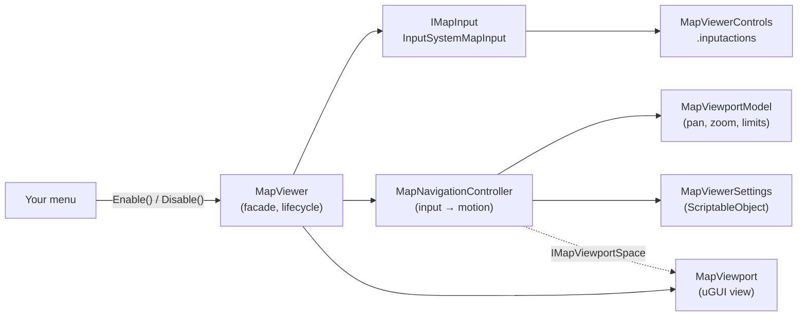

# Map Viewer

A drop-in, pan-and-zoom map for Unity uGUI, built on the Input System. Designers assign any sprite in the
Inspector; players pan and zoom with a gamepad or keyboard and mouse. Two calls, `Enable()` and `Disable()`,
show and hide it, so it slots into a main menu or pause menu.

  

## Quick start

1. Open `Assets/MapViewer/Samples/Scenes/MapViewerDemo.unity` and press Play.
2. The map opens full screen over a mock pause menu. Press **Esc** / **B** to close it, and **Open Map**,
   **Enter** / **A** or **M** / **View** to open it again.

| Action   | Gamepad                  | Keyboard & mouse      |
|----------|--------------------------|-----------------------|
| Pan      | Left stick or D-pad      | Middle-click and drag |
| Zoom in  | Right trigger            | Scroll up             |
| Zoom out | Left trigger             | Scroll down           |

Triggers are analog: a light press zooms slowly. Scroll zoom keeps the point under the cursor in place.

## Adding a map to your UI

1. **GameObject > UI > Map Viewer** adds the prefab to the selected canvas. It creates a canvas and an
   EventSystem if the scene has none. You can also drag in `Assets/MapViewer/Prefabs/MapViewer.prefab`.
2. Select it and assign your image to **Map Sprite**. Any sprite works; the aspect ratio is kept and the
   Scene view previews it straight away.
3. The prefab stretches to its parent. Anchor or resize it to embed the map in a panel instead.

For sharp results when zooming, import map sprites with **Generate Mip Maps** on, **Wrap Mode** set to
Clamp and a **Max Size** large enough for your highest zoom.

## Configuring pan and zoom

The tuning lives in a `MapViewerSettings` asset (**Create > Map Viewer > Map Viewer Settings**), which the
MapViewer Inspector also edits in place. Share one asset between menus or make variants per menu. Changes
made in Play Mode apply immediately.

| Setting | Default | Meaning |
|---|---|---|
| Pan › Speed | 1 | Stick / D-pad pan speed, in viewport lengths per second (along the shorter side). |
| Pan › Smooth Time | 0.08 | Seconds for stick panning to ease in and out. 0 responds instantly. |
| Pan › Invert | Off | Off: the stick moves the view. On: the stick pushes the map. |
| Pan › Drag Sensitivity | 1 | 1 keeps the map locked under the cursor while dragging. |
| Zoom › Fit Mode | Fit | Map size at 1x zoom. Fit shows the whole map; Fill covers the viewport. |
| Zoom › Min Zoom / Max Zoom | 1 / 4 | Zoom limits, as multiples of the Fit Mode size. |
| Zoom › Default Zoom | 1 | Zoom after the view is reset. |
| Zoom › Speed | 1.5 | Trigger zoom speed, in doublings per second. |
| Zoom › Step Multiplier | 1.25 | Zoom per scroll-wheel notch. |
| Zoom › Zoom Towards Pointer | On | Scroll zoom keeps the point under the cursor in place. |
| Zoom › Smooth Time | 0.1 | Seconds for zoom changes to ease in. 0 zooms instantly. |
| Require Pointer Over Map | On | Scroll zoom and drags only start while the cursor is over the map. |

Bindings live in `Assets/MapViewer/Input/MapViewerControls.inputactions`, in a dedicated **Map** action
map that is only enabled while a map is open. Rebind or add devices there (for example WASD for **Pan**)
without touching code. It uses these actions:

| Action | Type | Bindings |
|---|---|---|
| Pan | Vector2 | Left stick, D-pad |
| Zoom | Axis | 1D axis: right trigger (+), left trigger (−) |
| ZoomStep | Axis | Mouse scroll Y |
| Drag | Button | Middle mouse button |
| Point | Vector2 | Mouse position |

## Integrating with a menu

`MapViewer` implements `IMapViewer`, the contract a menu needs:

```csharp
using Maps;
using UnityEngine;

public class PauseMenu : MonoBehaviour
{
    [SerializeField] MapViewer map;
    [SerializeField] GameObject buttons;

    void OnEnable() => map.EnabledChanged += OnMapEnabledChanged;
    void OnDisable() => map.EnabledChanged -= OnMapEnabledChanged;

    public void OpenMap() => map.Enable();    // Shows the map and enables all of its input actions.
    public void CloseMap() => map.Disable();  // Hides the map and disables all of its input actions.

    void OnMapEnabledChanged(bool isOpen) => buttons.SetActive(!isOpen);
}
```

No code is needed for the basics: point a Button's **On Click** at `MapViewer.Enable`, and use the
**On Enabled** / **On Disabled** events in the Inspector to react to it.

| Member | Purpose |
|---|---|
| `Enable()` / `Disable()` | Show or hide the map along with its input actions. Hidden maps cost nothing per frame. |
| `IsEnabled`, `EnabledChanged` | Current state, and a C# event raised on every change. |
| `Toggle()` | Convenience for a single "Map" button. |
| `MapSprite`, `Settings` | Swap the map or its tuning at runtime, e.g. per level or floor. |
| `ResetView()`, `CenterOn(Vector2)` | Jump to the default view, or center on a normalized map point such as the player. |
| `Model` | Current pan and zoom, with `NormalizedToViewport` / `ViewportToNormalized` for overlays and markers. |
| `InputSource` | Replace the input source, e.g. for replays or another input system. |

Things worth knowing when you wire it up:

- **Pause menus:** the map runs on unscaled time, so it works while `Time.timeScale` is 0.
- **Gamepad UI navigation:** the EventSystem also listens to the stick and D-pad. Hide or deselect menu
  buttons while the map is open; the sample's `MapMenuExample` does this through `EnabledChanged`.
- **Several maps:** viewers can share the actions asset. Actions are reference counted, so disabling one
  map never cuts off another that is still open.
- **Mouse scroll:** one notch counts as one zoom step with the Input System's default *Scroll Delta
  Behavior* (Uniform Across All Platforms). If a project switches to platform-specific ranges, add a
  **Scale** processor to the ZoomStep binding.

## Architecture

The code is split so each piece has one job and depends on abstractions rather than on Unity's input or
UI systems. Everything lives in the `Maps` namespace.



| Type | Responsibility |
|---|---|
| `MapViewer` | Composition root and public API: wires the pieces, owns the enable/disable lifecycle and events. |
| `MapViewportModel` | Engine-agnostic pan and zoom state: fit/fill sizing, zoom limits, zooming around a pivot, clamping to the map edges and normalized map coordinates. |
| `MapNavigationController` | Turns a frame of input into motion: stick pan speed, drag, trigger zoom rate, scroll zoom steps and frame-rate independent easing. |
| `IMapInput`, `MapInputFrame` | Device-agnostic input contract. `InputSystemMapInput` implements it with `InputActionReference`s. |
| `MapViewport` | uGUI presentation: shows the sprite, keeps its aspect and renders pan and zoom on a masked content rect. Implements `IMapViewportSpace` for screen-to-map conversion. |
| `MapViewerSettings` | Designer-facing tuning data, split into Pan and Zoom sections. |

How it maps to SOLID:

- **Single responsibility:** geometry, input interpretation, device reading, presentation and lifecycle are
  separate classes.
- **Open/closed:** new devices are new bindings in the asset or a new `IMapInput`. New features such as
  markers, a minimap or touch pinch build on the model's coordinates without editing the core.
- **Liskov substitution:** any `IMapInput` or `IMapViewportSpace` can stand in for the shipped ones; the
  tests drive the controller with fakes.
- **Interface segregation:** menus only see `IMapViewer`; the controller only needs the single-method
  `IMapViewportSpace`.
- **Dependency inversion:** the navigation logic depends on `MapInputFrame` and interfaces, not on the Input
  System or uGUI.

## Project layout

```
Assets/MapViewer/
├─ Runtime/        Maps.Runtime assembly: MapViewer, Core/, Input/, Settings/, View/
├─ Editor/         Maps.Editor assembly: inspectors and the GameObject > UI > Map Viewer menu item
├─ Input/          MapViewerControls.inputactions
├─ Prefabs/        MapViewer.prefab
├─ Settings/       DefaultMapViewerSettings.asset
├─ Samples/        Demo scene, pause menu example and a generated sample map (safe to delete)
└─ Tests/          EditMode (model, controller, input bindings) and PlayMode (prefab end to end)
```

## Tests

Run them from **Window > General > Test Runner**, or headless with the Unity CLI while the project is
closed in the Editor:

```bash
unity test . --mode EditMode
```

```bash
unity test . --mode PlayMode
```

The EditMode suite covers the model's geometry, the controller's pan and zoom behavior, and the shipped
bindings, driven with virtual gamepad and mouse devices. The PlayMode suite exercises the prefab end to
end: `Enable()` / `Disable()` toggling visibility and every action, trigger zoom (also with
`Time.timeScale` at 0), stick and D-pad pan, scroll zoom and middle-button drag.

## Requirements

- Unity 6000.3 or newer
- Input System 1.20 with **Active Input Handling** set to Input System Package (or Both)
- uGUI 2.0
